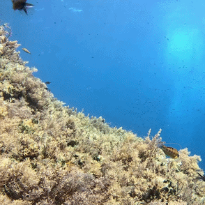

## Welcome to My GitHub Wonderland! 

You've just stumbled upon my little corner of the internet, lucky you.
Here, you'll find a mix of brilliant ideas, half-baked experiments, and the occasional *"what was I thinking?"* commits.
#### 💡Read more about me **[here](https://drdolapointhemaking.netlify.app/)**

<h3 align="center">AI, Computer Vision & Research Tools:</h3>

<!-- Python -->

<!-- PyTorch -->

<!-- TensorFlow -->

<!-- OpenCV -->

<!-- Jupyter -->

<!-- NumPy -->

<!-- Pandas -->

<!-- Scikit Learn -->

<!-- Git -->

<!-- Docker -->

<!-- Linux -->

<!-- VS Code -->

<!-- CUDA -->

<!-- Google Colab -->

<!-- R -->

<h3 align="center">Research & Coding Activity</h3>

<table align="center" border="0" cellpadding="10" cellspacing="8">
  <tr>
    <td align="center">
      
    </td>
    <td align="center">
      
    </td>
  </tr>
</table>

<h3 align="center"> Featured Computer Vision Project</h3>

<h4 align="center">Automated Fish Tracking</h4>

  

AI-powered fish detection and multi-object tracking for ecological and behavioural analysis.

